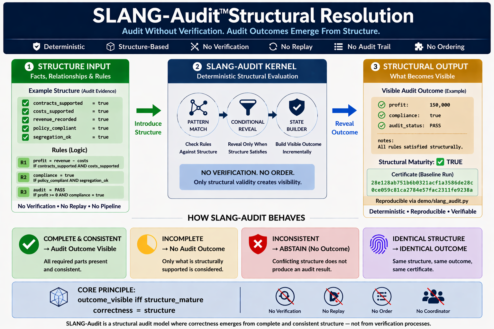

# ⭐ **SLANG-Audit**

## **Audit Without Verification — Structural Resolution Kernel**


**Proven in ~965 Bytes.**

Audit outcomes emerge directly from structure—no replay, no reconciliation, no workflow, only structural correctness.

---

**Deterministic • Structure-Based • No Verification Workflow • No Replay • No Reconciliation Dependency**

**No Time • No Order • No Coordinator • No Verification Pipeline**

---

## ⚡ **The Claim**

An audit outcome can be determined without verification workflows, replay, or reconciliation processes.

### **The Unifying Principle**

`correctness = structure`

If correctness remains after removing a dependency, that dependency was never fundamental.

---

## 🌍 **A World Built on Verification**

For decades, audit systems have been built on dependencies:

- verification procedures  
- transaction replay  
- reconciliation workflows  
- approval chains  
- audit trails  

Each treated as essential.

But what if they are not?

---

## 🔄 **The Shift**

Across domains, a pattern emerges:

correctness does not depend on the mechanism we assumed it did

It can be preserved by something deeper:

**structure**

---

## 🧱 **Dependency Elimination Framework**

| Domain | Removed Dependency | What Preserves Correctness |
|---|---|---|
| Time | clocks | structure |
| Decision | order | structure |
| Meaning | sequence | structure |
| Money | transactions | structure |
| Truth | agreement | structure |
| Computation | execution | structure |
| AI | inference | structure |
| Cybersecurity | process / pipelines | structure |
| Identity | authority / registry | structure |
| Consensus | voting / quorum | structure |
| Network | connectivity | structure |
| Audit | verification | structure |

Each row removes a dependency — yet correctness remains intact.

Nothing is replaced.  
Nothing is approximated.  
Only the dependency is eliminated.

---

## ⚡ **The One-Line Breakthrough**

An audit can resolve correctly without any verification process.

---

## ⚡ **Try it in 30 seconds**

Run the kernel:

```
python demo/slang_audit.py
```

Run again:

```
python demo/slang_audit.py
```

Modify structure → run again.

---

## 🔍 **What You Will Observe**

- deterministic audit resolution  
- no verification workflow  
- no replay dependency  
- no reconciliation steps  
- incomplete structure produces no forced outcome  
- identical structure produces identical result  

---

## 🧭 **Visual Overview**



---

## 🧭 **Framework & References**

### **Docs**
- [Quickstart](docs/Quickstart.md)  
- [FAQ](docs/FAQ.md)  
- [Proof Sketch](docs/Proof-Sketch.md)  
- [Structural Overview](docs/SLANG-Audit-Structural-Resolution.png)  

### **Framework**
- [Dependency Elimination Framework](docs/Dependency-Elimination-Framework.png)

### **Demo**
- [demo/slang_audit.py](demo/slang_audit.py)

### **Verification**
- [VERIFY/VERIFY.txt](VERIFY/VERIFY.txt)  
- [VERIFY/FREEZE_DEMO_SHA256.txt](VERIFY/FREEZE_DEMO_SHA256.txt)

### **Repository**
- [demo/](demo/) — kernel  
- [docs/](docs/) — explanation  
- [VERIFY/](VERIFY/) — reproducibility  

---

## ⚡ **The Core Structural Model**

`outcome_visible iff structure_mature`

`structure_mature = complete AND consistent`

Audit correctness is not derived from process.

`correctness = structure`

---

## ⚖️ **What This Is / Is Not**

### **SLANG-Audit IS:**
- a minimal structural audit kernel  
- a deterministic audit outcome generator  
- a proof that verification is not fundamental  
- a structure-first correctness demonstration  

### **SLANG-Audit IS NOT:**
- a full audit system  
- a compliance engine  
- a regulatory framework  
- a replacement for audit infrastructure  

---

## ⚠️ **Read This Carefully**

This is not:

- faster audit  
- automated verification  
- optimized reconciliation  

Replay-based verification is not required for correctness.

Audit truth does not emerge from process.

It emerges from structure.

---

## 🔥 **What This Proves (Removal of Dependencies)**

This kernel proves that audit correctness does not require:

- verification workflows  
- reconciliation pipelines  
- replay mechanisms  
- execution traces  
- sequencing  

---

## 🔥 **Structural Resolution Model (Extended)**

`resolve(S) ->`

- `RESOLVED` if `structure_mature`  
- `INCOMPLETE` if structure incomplete  
- `ABSTAIN` if structure conflicting  

**Visibility rule:**

`outcome_visible iff structure_mature`

### **Implementation Note — ABSTAIN**

ABSTAIN is part of the structural model.

In this reference implementation:

- ABSTAIN is conceptually defined  
- but not fully implemented in code  

This is intentional.

The kernel isolates the core invariant:

`correctness = structure`

Extended versions may include:

- explicit conflict tracking  
- ABSTAIN propagation  
- structural certificate generation  

---

## 🛡 **Structural Safety Model**

- incomplete → no forced outcome  
- conflicting → no unsafe outcome  
- complete → deterministic outcome  

No guessing. No forcing. No artificial verification.

---

## 🔐 **Structural Certificate**

Final structure produces a deterministic certificate:

`same structure -> same certificate`

Certificate is:

- reproducible  
- execution-independent  
- verification-independent  

`final structure = sufficient proof`

Proof emerges from structure — not from process.

---

## 🧠 **Structural Challenge**

Can identical structure produce different audit outcomes?

`S1 = S2`  
`Outcome1 ≠ Outcome2`

A full challenge set is available separately for deeper exploration.

---

## 🔁 **Deterministic Guarantees**

### **Determinism**
`S1 = S2 -> Outcome1 = Outcome2`

### **Order Independence**
Rule order does not matter.

### **Idempotence**
Repeated runs → identical result.

---

## 🧩 **Reference Demonstration (Embedded)**

### **Scenario 1 — Baseline**

Run:

```
python demo/slang_audit.py
```

Observe:

- audit may not resolve if structure is incomplete  
- no forced `"pass"` or `"fail"`  

### **Scenario 2 — Repeatability**

Run again:

- identical result  

### **Scenario 3 — Break Structure**

Modify structure → run again.

Observe:

- no forced audit outcome  
- system remains structurally silent  

### **Scenario 4 — Order Independence**

Reorder rules → run.

- identical result  

### **Scenario 5 — Direct Injection**

Provide final structure → run.

- outcome appears immediately  

### **Scenario 6 — Partial Structure**

Provide partial structure → run.

- no forced outcome  

---

## 🧠 **Critical Insight**

System does not:

- verify  
- replay  
- reconcile  
- guess  

Instead:

- it resolves structure  

---

## 🌌 **Why This Is Bigger Than It Looks**

This is a minimal proof that:

- audit visibility does not require verification workflows  
- replay does not define correctness  
- audit appears only when structure becomes mature  

If this holds, audit transforms from process to structure.

---

## 🧠 **Phantom Truth**

A reported value may exist in the system.

But structural audit truth may not.

The system does not reject it.  
The system does not confirm it.  

It simply refuses to grant audit reality to what structure does not support.

---

## 📊 **Comparison**

| Model | Verification Required | Replay Required | Structure-Based | Deterministic |
|---|---|---|---|---|
| Traditional | Yes | Yes | No | Conditional |
| Audit Flow | Yes | Yes | Partial | Conditional |
| SLANG-Audit | No | No | Yes | Yes |

---

## 🌍 **Implications**

If this scales:

- verification becomes optional  
- audit becomes structural  
- reconciliation becomes secondary  
- correctness becomes intrinsic  

---

## 🧾 **Structural Lineage**

SLANG-Audit is part of a broader structural pattern emerging across domains:

- SLANG (Computation) → correctness without execution  
- SLANG-Money → state without transactions  
- SLANG-AI → decisions without inference pipelines  
- SLANG-Medical → diagnosis without procedural workflows  
- SLANG-Insurance → claims without approval chains  
- SLANG-Cybersecurity → detection without process pipelines  
- SLANG-Audit → correctness without verification  

Each removes a different dependency.

Yet the outcome remains.

`correctness = structure`

---

## 📜 **License**

See: [LICENSE](LICENSE)

**Reference Implementation:**  
Open Standard — free to use, study, implement, extend, and deploy

**Architecture and Documentation:**  
CC BY-NC 4.0

---

## 🔭 **Roadmap (Exploratory)**

- structural conflict classification  
- invariant validation  
- multi-entity audit resolution  
- audit certification layers  

---

## 🌐 **More SLANG Structural Reference Implementations**

This repository is part of the broader **SLANG-Observatory** — a growing collection of tiny deterministic structural kernels across multiple domains.

The observatory includes demonstrations such as:

- invoice approval without workflows  
- cybersecurity escalation without pipelines  
- hurricane forecast visibility without forced publication  
- password reset resolution without orchestration  
- claims resolution without approval chains  
- and many more structural admissibility demonstrations  

All built on the same invariant:

`correctness = structure`

Explore the broader SLANG ecosystem here:

🔗 [SLANG-Observatory](https://github.com/OMPSHUNYAYA/SLANG-Observatory)

---

## 🔗 **Related Structural References**

- [ORL](https://github.com/OMPSHUNYAYA/Orderless-Ledger) — ledger correctness from structure without ordering  
- [STOCRS](https://github.com/OMPSHUNYAYA/STOCRS) — computation from structure without execution  
- [STIME](https://github.com/OMPSHUNYAYA/Structural-Time) — time from valid structural transitions  
- [SSUM-Time](https://github.com/OMPSHUNYAYA/SSUM-Time) — structural clock for time reconstruction and recovery  
- [SLANG-Money](https://github.com/OMPSHUNYAYA/SLANG-Money) — financial state from structure without transactions  

---

## 🧭 **Final Statement**

Verification did not create correctness.  
Replay did not create correctness.  
Reconciliation did not create correctness.  

**Correctness emerged from structure.**
