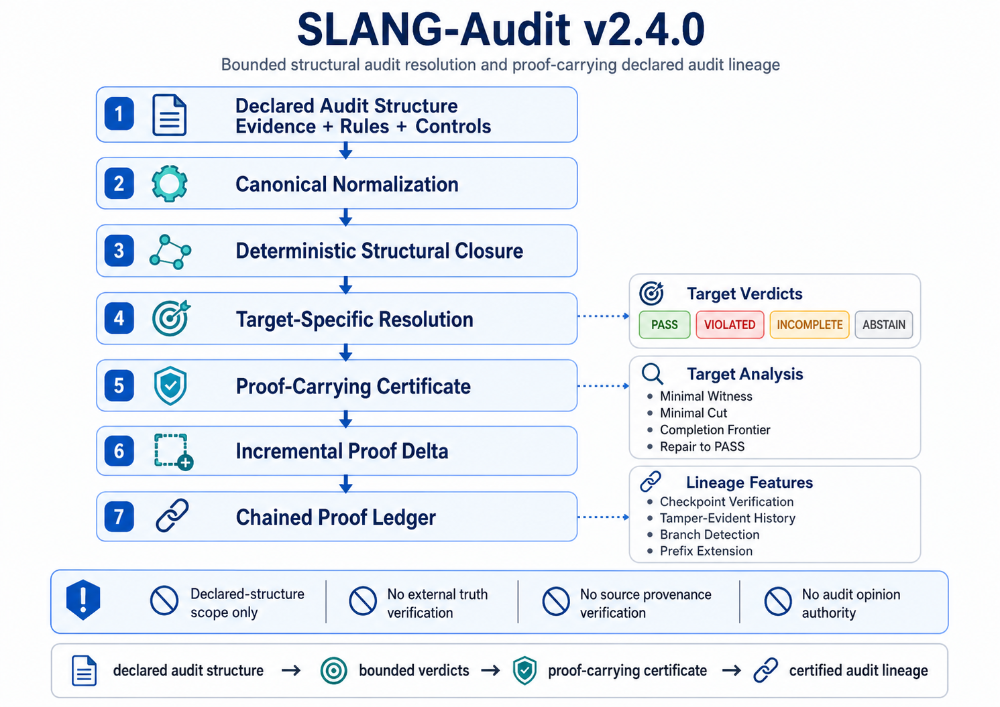

# SLANG-Audit

## Proof-carrying structural audit resolution with target-specific explanation and declared-state lineage

**SLANG-Audit resolves caller-declared audit structure. It does not authenticate external evidence, verify real-world truth, perform professional audit procedures, or carry audit-opinion authority.**

[](./VERSION)
[](./core/)
[](./core/SLANG_Audit_Reference_Resolver_v2_4_0.py)
[](./validation/SLANG_Audit_Proof_Ledger_Validation_v1_0_0.py)
[](./validation/SLANG_Audit_Package_Verifier_v2_4_0.py)
[](./validation/SLANG_Audit_Cross_Language_Conformance_Gate_v1_0_0.py)
[](./validation/SLANG_Audit_Standalone_Verifier_v1_0_0.js)
[](./docs/Structural-Model.md)
[](./docs/Incremental-Proof-Deltas.md)
[](./docs/Proof-Ledger-and-Checkpoints.md)
[](./docs/Scientific-and-Operational-Boundaries.md)
[](./LICENSE)
[](https://creativecommons.org/licenses/by-nc/4.0/)
[](./REPRODUCIBILITY_SCOPE.txt)
[](https://github.com/OMPSHUNYAYA/Shunyaya-Symbolic-Mathematics-Master-Docs)

[](https://github.com/OMPSHUNYAYA/SLANG-Audit/actions/workflows/verify.yml)

---

## Overview

SLANG-Audit is a bounded deterministic resolver for declared audit evidence, structural rules, and target controls.

Its core relation is:

```text
declared audit evidence + structural rules + controls
-> deterministic closure
-> bounded target verdicts
-> proof-carrying certificate
```

The architecture extends that result with:

```text
target verdict
-> dependency isolation
-> minimal sufficient witness
-> structural criticality
-> bounded counterfactual repair

previous certified state + declared delta
-> affected-target propagation
-> preserved unaffected proofs
-> fresh full-recomputation equivalence

ordered predecessor-bound deltas
-> proof ledger
-> lineage root
-> pinned checkpoint
```

The resolver operates only on admitted structure. It does not decide whether an external document, ledger, log, policy, statement, signature, timestamp, or source is authentic or true.

Start with the [Quickstart](./docs/Quickstart.md), then see the [Input Contract](./docs/Input-Contract.md), [Structural Model](./docs/Structural-Model.md), [Certificate and Verification](./docs/Certificate-and-Verification.md), [Minimal Witness and Criticality](./docs/Minimal-Witness-and-Criticality.md), [Incremental Proof Deltas](./docs/Incremental-Proof-Deltas.md), [Proof Ledger and Checkpoints](./docs/Proof-Ledger-and-Checkpoints.md), and [Claim Boundaries](./CLAIM_BOUNDARIES.txt).

---

## Structural flow

[](./docs/SLANG-Audit-Diagram.png)

*Declared audit structure -> target-specific resolution -> minimal explanation and criticality -> certified state evolution -> checkpoint-bound lineage.*

[**View the full-size SLANG-Audit diagram**](./docs/SLANG-Audit-Diagram.png)

---

## What v2.4.0 provides

- Strict JSON parsing with duplicate-key rejection and bounded resource limits.
- Explicit Boolean audit atoms, evidence sources, rules, controls, and targets.
- Optional evidence SHA-256 commitments with identity-binding semantics only.
- Canonical structural normalization and deterministic SHA-256 identities.
- Deterministic fixed-point structural closure.
- Target-specific `PASS`, `VIOLATED`, `INCOMPLETE`, and `ABSTAIN` verdicts.
- Contradiction isolation so unrelated contradictions do not automatically contaminate unrelated targets.
- Rule derivation lineage and target-specific support witnesses.
- Exact bounded minimal sufficient witness search.
- Exact bounded minimal verdict cuts.
- Completion frontiers for incomplete targets.
- Bounded repair-to-`PASS` structural counterfactuals.
- Incremental evidence/rule deltas bound to a previous certified bundle.
- Affected-target propagation and target-proof preservation when supported by dependency analysis.
- Mandatory equality with a fresh full recomputation for accepted incremental results.
- Predecessor-bound multi-step proof ledgers.
- Deterministic lineage roots and pinned checkpoints.
- Deletion, reordering, substitution, semantic-forgery, and terminal-tamper rejection.
- Branch comparison with `SAME_LINEAGE`, `PREFIX_EXTENSION`, `BRANCH_DETECTED`, and `DIFFERENT_GENESIS` classifications.
- Same-terminal alternative-history differentiation when compared against a previously pinned checkpoint.
- A separately implemented JavaScript verifier for bundle, incremental, ledger, and checkpoint verification.
- Ten frozen genuine cross-language conformance vectors and six rehashed semantic mutation vectors.
- An optional byte-to-SHA-256 evidence content-binding verifier, separated from the structural resolver.
- A standalone portable certificate and ledger format specification.

The core reference resolver uses the Python standard library only. The package also includes a standalone JavaScript verifier that uses the Node.js standard runtime with no external packages.

---

## Outcome contract

Resolver states:

```text
RESOLVED | INCOMPLETE | ABSTAIN | FORBIDDEN | UNSUPPORTED
```

Target verdicts:

```text
PASS | VIOLATED | INCOMPLETE | ABSTAIN
```

A `VIOLATED` target can still occur within resolver state `RESOLVED`: the resolver has successfully determined that the declared structure opposes at least one required control literal.

An `INCOMPLETE` target lacks sufficient admitted structure for a decision.

An `ABSTAIN` target contains a contradiction affecting a required target literal.

---

## Declared audit contract

A source may declare claims such as:

```text
contracts_supported=true
costs_supported=true
reported_profit_supported=true
```

Rules may derive further structure:

```text
contracts_supported=true -> revenue_supported=true
costs_supported=true -> expense_supported=true
```

A control may require:

```text
expense_supported=true
revenue_supported=true
```

If both requirements are structurally supported, that target receives:

```text
PASS
```

This means only that the declared structural conditions are satisfied under the admitted model.

It does not mean that the underlying contracts, costs, accounting treatment, or financial statements have been independently authenticated or audited.

---

## Minimal sufficient witnesses

For the bundled `profit_recognition` example, the full structure contains four declared evidence sources, but only two are required for that target.

The canonical minimal witness uses:

```text
contracts_ledger
cost_ledger
derive_revenue_support
derive_expense_support
```

and excludes target-irrelevant declarations.

The restricted witness substructure independently reproduces the same target verdict.

See [Minimal Witness and Criticality](./docs/Minimal-Witness-and-Criticality.md) and the [minimal witness example](./examples/SLANG_Audit_Profit_Recognition_Minimal_Witness_Input_v2_4_0.json).

---

## Structural criticality and counterfactuals

The resolver can ask the complementary question:

```text
What is the smallest declared structural change that changes or repairs this verdict?
```

For the demonstration target:

```text
remove contracts_ledger
-> PASS becomes INCOMPLETE
```

For an incomplete target, a completion frontier can identify a smallest hypothetical structural addition that would produce `PASS` within the declared model.

For `VIOLATED` and `ABSTAIN`, bounded repair search can combine declared-source removals and hypothetical literal additions.

These are structural counterfactuals, not real-world audit recommendations.

---

## Incremental proof deltas

A delta is bound to a specific previous bundle:

```text
previous certified bundle + declared evidence/rule delta
-> updated certified bundle
```

For each update, SLANG-Audit identifies the dependency-impacted targets and target-local proofs that remain unchanged.

Accepted incremental output must satisfy:

```text
incremental updated result == fresh full recomputation result
```

v2.4.0 supports incremental evidence and rule additions/replacements/removals. Atom declarations, control definitions, and target-set mutations remain outside the incremental profile.

See [Incremental Proof Deltas](./docs/Incremental-Proof-Deltas.md).

---

## Proof ledger and checkpoints

A bounded declared audit history can be represented as:

```text
S0 + D1 -> S1
S1 + D2 -> S2
S2 + D3 -> S3
S3 + D4 -> S4
```

Each ledger entry is bound to its predecessor, base state, delta, incremental certificate, and updated state.

The bundled validation checks:

```text
valid ledger                         -> PASS
pinned checkpoint                    -> PASS
deleted historical entry             -> REJECT
reordered historical entries         -> REJECT
substituted delta                     -> REJECT
rehashed semantic transition forgery -> REJECT
terminal certificate tamper           -> REJECT
same-terminal rewritten history       -> different lineage
common-prefix branch                  -> BRANCH_DETECTED
proper continuation                   -> PREFIX_EXTENSION
```

A checkpoint is a deterministic structural commitment. It is not a digital signature, trusted timestamp, or proof that a history was externally published at a particular time.

See [Proof Ledger and Checkpoints](./docs/Proof-Ledger-and-Checkpoints.md) and [External Checkpoint Anchoring](./docs/External-Checkpoint-Anchoring.md).

---

## Cross-language verification

SLANG-Audit includes a separately implemented JavaScript verifier. It does not import or invoke the Python resolver.

The frozen conformance gate requires both implementations to accept genuine vectors and reject rehashed semantic mutations:

```text
10 genuine bundles x 2 verifiers        -> 20 accepts
6 semantic mutations x 2 verifiers      -> 12 rejects
1 incremental bundle x 2 verifiers      -> 2 accepts
1 proof ledger x 2 verifiers             -> 2 accepts
1 checkpointed ledger x 2 verifiers      -> 2 accepts
JavaScript verifier self-test            -> 1 pass

TOTAL 39/39 PASS
```

See [Cross-Language Verification](./docs/Cross-Language-Verification.md) and the [Portable Certificate and Ledger Specification](./docs/Portable-Certificate-and-Ledger-Specification.md).

---

## Optional evidence content binding

The core resolver treats evidence commitments as declared identity-binding strings only. A separate optional utility can additionally verify:

```text
SHA256(exact supplied file bytes) == declared commitment
```

This establishes byte-to-commitment equality only. It does not establish source provenance, authenticity, truth, completeness, or trusted time.

See [Evidence Content Binding](./docs/Evidence-Content-Binding.md).

---

## Deterministic validation

Current bundled gates:

```text
Core self-test:             166/166 PASS
Proof-ledger validation:      50/50 PASS
Cross-language conformance:   39/39 PASS
Package verification:         104/104 PASS
```

The proof-ledger validation also verifies that a different internally valid history can reach the exact same terminal bundle while remaining distinguishable from the original history by lineage root and checkpoint identity.

See [Validation Evidence](./validation/Validation-Evidence.md) and the [machine-readable validation report](./validation/SLANG_Audit_Proof_Ledger_Validation_Report_v1_0_0.json).

---

## Quick verification

Run the core self-test:

```text
python -B core/SLANG_Audit_Reference_Resolver_v2_4_0.py --self-test
```

Run the deterministic demo:

```text
python -B core/SLANG_Audit_Reference_Resolver_v2_4_0.py --demo
```

Run the proof-ledger validation:

```text
python -B validation/SLANG_Audit_Proof_Ledger_Validation_v1_0_0.py --self-test
python -B validation/SLANG_Audit_Proof_Ledger_Validation_v1_0_0.py --run
```

Run the JavaScript verifier self-test and cross-language gate:

```text
node validation/SLANG_Audit_Standalone_Verifier_v1_0_0.js --self-test
python -B validation/SLANG_Audit_Cross_Language_Conformance_Gate_v1_0_0.py --self-test
python -B validation/SLANG_Audit_Cross_Language_Conformance_Gate_v1_0_0.py --run
```

Run the optional evidence content-binding utility self-test:

```text
python -B validation/SLANG_Audit_Evidence_Content_Binding_Verifier_v1_0_0.py --self-test
```

Run the selected-artifact package gate:

```text
python -B validation/SLANG_Audit_Package_Verifier_v2_4_0.py --self-test
python -B validation/SLANG_Audit_Package_Verifier_v2_4_0.py --verify
```

The same deterministic verification is defined in the [workflow](./.github/workflows/verify.yml).

---

## Resolve and verify an audit structure

Resolve the bundled demonstration input:

```text
python -B core/SLANG_Audit_Reference_Resolver_v2_4_0.py --resolve examples/SLANG_Audit_Demo_Input_v2_4_0.json --pretty
```

Save a bundle:

```text
python -B core/SLANG_Audit_Reference_Resolver_v2_4_0.py --resolve examples/SLANG_Audit_Demo_Input_v2_4_0.json --pretty > resolved_bundle.json
```

Verify it:

```text
python -B core/SLANG_Audit_Reference_Resolver_v2_4_0.py --verify resolved_bundle.json
```

Expected:

```text
PASS
```

Verify the same bundle with the separately implemented JavaScript verifier:

```text
node validation/SLANG_Audit_Standalone_Verifier_v1_0_0.js --verify-bundle resolved_bundle.json
```

Expected:

```text
PASS
```

---

## Build and verify the proof ledger

Build the bundled proof ledger from its genesis bundle and delta sequence:

```text
python -B core/SLANG_Audit_Reference_Resolver_v2_4_0.py --ledger validation/SLANG_Audit_Proof_Ledger_Demo_Genesis_Bundle_v2_4_0.json validation/SLANG_Audit_Proof_Ledger_Demo_Delta_Sequence_v1_0_0.json --pretty > proof_ledger.json
```

Verify the ledger:

```text
python -B core/SLANG_Audit_Reference_Resolver_v2_4_0.py --verify-ledger proof_ledger.json
```

Verify against the separately pinned checkpoint:

```text
python -B core/SLANG_Audit_Reference_Resolver_v2_4_0.py --verify-ledger-checkpoint proof_ledger.json validation/SLANG_Audit_Proof_Ledger_Demo_Checkpoint_v1_0_0.json
```

Expected for both verification commands:

```text
PASS
```

The same ledger and checkpoint can be verified independently with JavaScript:

```text
node validation/SLANG_Audit_Standalone_Verifier_v1_0_0.js --verify-ledger proof_ledger.json
node validation/SLANG_Audit_Standalone_Verifier_v1_0_0.js --verify-ledger-checkpoint proof_ledger.json validation/SLANG_Audit_Proof_Ledger_Demo_Checkpoint_v1_0_0.json
```

---

## Frozen reference artifacts

Only the selected executable and machine-readable verification surface is checksum-protected.

The manifest is:

[**FROZEN_ARTIFACT_SHA256SUMS_v2_4_0.txt**](./validation/FROZEN_ARTIFACT_SHA256SUMS_v2_4_0.txt)

Documentation, diagram, editable examples, workflow configuration, rights files, version metadata, and narrative validation material remain intentionally outside the checksum set.

See [Integrity Scope](./docs/Integrity-Scope.md).

---

## Repository map

### Core

- [`core/`](./core/)
- [`core/SLANG_Audit_Reference_Resolver_v2_4_0.py`](./core/SLANG_Audit_Reference_Resolver_v2_4_0.py)

### Documentation

- [`docs/`](./docs/)
- [`docs/SLANG-Audit-Diagram.png`](./docs/SLANG-Audit-Diagram.png)
- [`docs/Architecture.md`](./docs/Architecture.md)
- [`docs/Quickstart.md`](./docs/Quickstart.md)
- [`docs/Input-Contract.md`](./docs/Input-Contract.md)
- [`docs/Structural-Model.md`](./docs/Structural-Model.md)
- [`docs/Certificate-and-Verification.md`](./docs/Certificate-and-Verification.md)
- [`docs/Portable-Certificate-and-Ledger-Specification.md`](./docs/Portable-Certificate-and-Ledger-Specification.md)
- [`docs/Cross-Language-Verification.md`](./docs/Cross-Language-Verification.md)
- [`docs/Evidence-Content-Binding.md`](./docs/Evidence-Content-Binding.md)
- [`docs/External-Checkpoint-Anchoring.md`](./docs/External-Checkpoint-Anchoring.md)
- [`docs/Minimal-Witness-and-Criticality.md`](./docs/Minimal-Witness-and-Criticality.md)
- [`docs/Incremental-Proof-Deltas.md`](./docs/Incremental-Proof-Deltas.md)
- [`docs/Proof-Ledger-and-Checkpoints.md`](./docs/Proof-Ledger-and-Checkpoints.md)
- [`docs/Integrity-Scope.md`](./docs/Integrity-Scope.md)
- [`docs/Scientific-and-Operational-Boundaries.md`](./docs/Scientific-and-Operational-Boundaries.md)
- [`docs/FAQ.md`](./docs/FAQ.md)

### Examples

- [`examples/`](./examples/)
- [`examples/README.md`](./examples/README.md)
- [`examples/SLANG_Audit_Demo_Input_v2_4_0.json`](./examples/SLANG_Audit_Demo_Input_v2_4_0.json)
- [`examples/SLANG_Audit_Profit_Recognition_Minimal_Witness_Input_v2_4_0.json`](./examples/SLANG_Audit_Profit_Recognition_Minimal_Witness_Input_v2_4_0.json)
- [`examples/SLANG_Audit_Incomplete_Example_v2_4_0.json`](./examples/SLANG_Audit_Incomplete_Example_v2_4_0.json)
- [`examples/SLANG_Audit_Violated_Example_v2_4_0.json`](./examples/SLANG_Audit_Violated_Example_v2_4_0.json)
- [`examples/SLANG_Audit_Abstain_Example_v2_4_0.json`](./examples/SLANG_Audit_Abstain_Example_v2_4_0.json)

### Validation

- [`validation/`](./validation/)
- [`validation/SLANG_Audit_Proof_Ledger_Validation_v1_0_0.py`](./validation/SLANG_Audit_Proof_Ledger_Validation_v1_0_0.py)
- [`validation/SLANG_Audit_Standalone_Verifier_v1_0_0.js`](./validation/SLANG_Audit_Standalone_Verifier_v1_0_0.js)
- [`validation/SLANG_Audit_Cross_Language_Conformance_Gate_v1_0_0.py`](./validation/SLANG_Audit_Cross_Language_Conformance_Gate_v1_0_0.py)
- [`validation/conformance/SLANG_Audit_Cross_Language_Conformance_Vectors_v1_0_0.json`](./validation/conformance/SLANG_Audit_Cross_Language_Conformance_Vectors_v1_0_0.json)
- [`validation/SLANG_Audit_Evidence_Content_Binding_Verifier_v1_0_0.py`](./validation/SLANG_Audit_Evidence_Content_Binding_Verifier_v1_0_0.py)
- [`validation/SLANG_Audit_Package_Verifier_v2_4_0.py`](./validation/SLANG_Audit_Package_Verifier_v2_4_0.py)
- [`validation/SLANG_Audit_Demo_Bundle_v2_4_0.json`](./validation/SLANG_Audit_Demo_Bundle_v2_4_0.json)
- [`validation/SLANG_Audit_Proof_Ledger_Demo_Genesis_Bundle_v2_4_0.json`](./validation/SLANG_Audit_Proof_Ledger_Demo_Genesis_Bundle_v2_4_0.json)
- [`validation/SLANG_Audit_Proof_Ledger_Demo_Delta_Sequence_v1_0_0.json`](./validation/SLANG_Audit_Proof_Ledger_Demo_Delta_Sequence_v1_0_0.json)
- [`validation/SLANG_Audit_Proof_Ledger_Demo_Checkpoint_v1_0_0.json`](./validation/SLANG_Audit_Proof_Ledger_Demo_Checkpoint_v1_0_0.json)
- [`validation/SLANG_Audit_Proof_Ledger_Demo_v1_0_0.json`](./validation/SLANG_Audit_Proof_Ledger_Demo_v1_0_0.json)
- [`validation/SLANG_Audit_Proof_Ledger_Validation_Report_v1_0_0.json`](./validation/SLANG_Audit_Proof_Ledger_Validation_Report_v1_0_0.json)
- [`validation/FROZEN_ARTIFACT_SHA256SUMS_v2_4_0.txt`](./validation/FROZEN_ARTIFACT_SHA256SUMS_v2_4_0.txt)
- [`validation/Validation-Evidence.md`](./validation/Validation-Evidence.md)
- [`validation/VERIFICATION_RESULT.txt`](./validation/VERIFICATION_RESULT.txt)

### Repository metadata, rights, and workflow

- [`.github/workflows/verify.yml`](./.github/workflows/verify.yml)
- [`.gitignore`](./.gitignore)
- [`VERSION`](./VERSION)
- [`requirements.txt`](./requirements.txt)
- [`TECHNICAL_STATUS.txt`](./TECHNICAL_STATUS.txt)
- [`CLAIM_BOUNDARIES.txt`](./CLAIM_BOUNDARIES.txt)
- [`REPRODUCIBILITY_SCOPE.txt`](./REPRODUCIBILITY_SCOPE.txt)
- [`COPYRIGHT_NOTICE.txt`](./COPYRIGHT_NOTICE.txt)
- [`THIRD_PARTY_NOTICES.txt`](./THIRD_PARTY_NOTICES.txt)
- [`LICENSE`](./LICENSE)

---

## Relationship to adjacent Shunyaya projects

```text
SLANG-Computation   = general bounded structural computation
SLANG-Money         = exact bounded structural financial-state resolution
SLANG-Cybersecurity = bounded structural chronology research and validation
SLANG-Audit         = bounded structural audit resolution and declared-state lineage
```

- [SLANG-Computation](https://github.com/OMPSHUNYAYA/SLANG-Computation)
- [SLANG-Money](https://github.com/OMPSHUNYAYA/SLANG-Money)
- [SLANG-Cybersecurity](https://github.com/OMPSHUNYAYA/SLANG-Cybersecurity)
- [Shunyaya Symbolic Mathematics Master Docs](https://github.com/OMPSHUNYAYA/Shunyaya-Symbolic-Mathematics-Master-Docs)

---

## Claim boundary

SLANG-Audit does not establish external truth, source authenticity, professional audit assurance, audit-opinion authority, accounting correctness, legal compliance, regulatory approval, signature authenticity, trusted timestamps, institutional endorsement, or production qualification for regulated audit infrastructure.

It also does not establish that replay, reconciliation, evidence validation, or verification are unnecessary in real-world auditing.

Independent third-party reproduction status:

```text
INDEPENDENT_THIRD_PARTY_REPRODUCTION: OPEN
```

See [Claim Boundaries](./CLAIM_BOUNDARIES.txt), [Scientific and Operational Boundaries](./docs/Scientific-and-Operational-Boundaries.md), and [Reproducibility Scope](./REPRODUCIBILITY_SCOPE.txt).

---

## Source and rights boundary

The repository contains synthetic project-authored audit structures and verification artifacts. It does not redistribute third-party audit datasets, financial statements, bank records, access logs, policy documents, proprietary audit objects, external audit reports, or external source code.

See [Third-Party Notices](./THIRD_PARTY_NOTICES.txt).

---

## License

SLANG-Audit uses a dual-license map for project-authored materials:

- **Software** - reference implementation, verification code, workflow code, synthetic software test fixtures, and machine-readable verification artifacts: **[Apache License 2.0](https://www.apache.org/licenses/LICENSE-2.0)**.
- **Architecture and documentation** - project-authored architecture, specifications, documentation, explanatory materials, and project-produced diagrams: **[CC BY-NC 4.0](https://creativecommons.org/licenses/by-nc/4.0/)**.
- **Third-party materials** - remain subject to their respective terms.

See [`LICENSE`](./LICENSE), [`COPYRIGHT_NOTICE.txt`](./COPYRIGHT_NOTICE.txt), and [`THIRD_PARTY_NOTICES.txt`](./THIRD_PARTY_NOTICES.txt).

---

## Summary

SLANG-Audit v2.4.0 is a bounded proof-carrying structural audit resolver with target-specific verdicts, minimal structural explanations, criticality analysis, certified incremental state evolution, and checkpoint-bound declared audit lineage.

```text
declared audit structure
-> deterministic target resolution
-> minimal structural explanation
-> structural criticality
-> certified audit-state evolution
-> tamper-evident declared lineage
```

The reference model carries no external truth-verification or audit-opinion authority.
